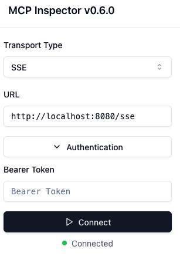

# MCP Google Drive Server

This project is a server for the Model Context Protocol (MCP) that integrates with Google Drive,
you can use it to upload Microsoft Word files to Google Drive, allowing for easy file management and sharing.
Connect to this server using the Model Context Protocol client, for instance, in Claude Desktop.

## Components

### Tools
- **upload_microsoft_world_file**:
  - Uploads a file content in Microsoft Word format to Google Drive in a specified folder.
  - Input parameters:
    - `folderName`: Name of the folder where the file will be uploaded. If null, the file will be uploaded to the root directory. (optional)
    - `fileName`: Name of the file to be uploaded.
    - `fileContent`: Content of the file to be uploaded.
  - Returns:
    - `url`: The URL of the uploaded file in Google Docs view format.

## What You Can Do
Once set up, you can ask Claude Desktop things like:
- *"What are the 10 famous touristic place of Sao Paulo, please save the result in my google drive"*
---

## Getting Started
### Prerequisites
- **Claude Desktop** ([Download here](https://claude.ai/download))
- **MCP Inspector** ([Quick start here]("https://github.com/modelcontextprotocol/inspector?tab=readme-ov-file#quick-start-ui-mode"))
- **Java 24+** ([Download here](https://adoptium.net/))
- **Maven** (included via `./mvnw`)
- **Generate your API Credentials**
  1. [Create a new Google Cloud project](https://console.cloud.google.com/projectcreate)
  2. [Enable the Google Drive API](https://console.cloud.google.com/apis/library/drive.googleapis.com)
  3. [Enable the Cloud Resource Manager API](https://console.cloud.google.com/apis/library/cloudresourcemanager.googleapis.com)
  4. [Set up ADC for a local development environment, inside Cloud Shell](https://cloud.google.com/docs/authentication/set-up-adc-local-dev-environment#google-idp)
     - Open Cloud Shell in your Google Cloud Console.
     - Run the following command: `gcloud auth application-default login --scopes=https://www.googleapis.com/auth/cloud-platform,https://www.googleapis.com/auth/drive`
     - This will open a browser window to authenticate your Google account and grant the necessary permissions.
     - After successful authentication, the credentials will be stored in your local environment, allowing the application to access Google Cloud resources.
     - Look for the credential file that was created, it should be something like: `Credentials saved to file: [/tmp/tmp.6Rvsdsdfesx/application_default_credentials.json]`
     - Copy the contents of the credential file to a new file named `application_default_credentials.json` in the home directory of your local machine. (e.g. `~/application_default_credentials.json`)

### 🎯 Choose Your Setup Method

| Method                                                               | Time | Requirements | Best For |
|----------------------------------------------------------------------|------|--------------|----------|
| **[📦 Native Binary - (not available yet)](#-native-binary-no-java)** | **min** | None! | **Most users** |
| [☕ Java Build](#-java-build-traditional)                             | 5 min | Java 24+ | Developers |
---

### ☕ Java Build (Traditional)

**For developers who want to build from source**

#### Clone the repository and generate the jar file:
```bash
git clone <this-repo>
cd mcp-google-drive-server
./mvnw clean package
```

## Testing with Claude Desktop (using STDIO)
### Then configure Claude Desktop with:
- To configure the 'mcp-google-drive-server' to run in [STDIO](https://modelcontextprotocol.io/docs/concepts/transports#standard-input%2Foutput-stdio) mode.
```json
{
  "mcpServers": {
    "mcp-google-drive-server": {
      "command": "/FULL/PATH/TO/java/24/bin/java",
      "args": [
        "-jar",
        "-Dspring.ai.mcp.server.stdio=true",
        "/FULL/PATH/TO/target/mcp-google-drive-server-0.0.1-SNAPSHOT.jar"
      ],
      "env": {
        "GOOGLE_APPLICATION_CREDENTIALS": "/FULL/PATH/TO/application_default_credentials.json"
      }
    }
  }
}
```
⚠️ **Use the full path to your java 24 installation, generated jar and application_default_credentials files.**


### Test It Works
1. Restart Claude Desktop
2. Look for the 🔧 icon in a new conversation
3. Try: *"What are the 10 famous touristic place of Sao Paulo, please save the result in my google drive"*

✅ **Success**: You should see Claude use the `upload_microsoft_world_file` tool!

### Troubleshooting
#### "Tool not found" in Claude Desktop
1. Check the JAR path is correct and absolute
2. Verify environment variables are set
3. Restart Claude Desktop completely
4. Check Claude Desktop's logs/console for errors

## Testing with MCP Inspector (using SSE)

To test the server in SSE mode, you can use the [MCP Inspector](https://github.com/modelcontextprotocol/inspector?tab=readme-ov-file#quick-start-ui-mode) tool.

### Run the application in SSE mode

First, run the application in SSE mode. This can be done by using the following command:

```bash
GOOGLE_APPLICATION_CREDENTIALS=/FULL/PATH/TO/application_default_credentials.json /FULL/PATH/TO/java/24/bin/java -jar /FULL/PATH/TO/target/mcp-google-drive-server-0.0.1-SNAPSHOT.jar
```
⚠️ **Use the full path to your java 24 installation, generated jar and application_default_credentials files.**

### Get an access token

The server is secured with OAuth2. To connect to it, you need an access token. You can get one by sending a request to the token endpoint:

```bash
curl -k -X POST -u mcp-client:secret http://localhost:8080/oauth2/token -d 'grant_type=client_credentials'
```

This will return a JSON response containing the access token:

```json
{
  "access_token": "...",
  "scope": "mcp.read mcp.write",
  "token_type": "Bearer",
  "expires_in": 299
}
```
And copy-paste the access token Or use JQ:
```bash
curl -k -X POST -u mcp-client:secret http://localhost:8080/oauth2/token -d 'grant_type=client_credentials' | jq -r ".access_token"
```
Store that token

### Start the MCP Inspector
```bash
npx @modelcontextprotocol/inspector@0.6.0
```
In the MCP inspector, paste your token. Click connect, and voilà!



if you click on the tab "Tools", and then "List Tools" you should see the `upload_microsoft_world_file` tool available.
You can test it by clicking on the tool and filling in the parameters, then clicking "Run Tool".

Note that the token is only valid for 5 minutes


## Enable Debug Logging
Set environment variable: `LOGGING_LEVEL_ROOT=DEBUG`

## Checking Logs
You can check the logs in the `/usr/lib/claude-desktop/target` directory of the claude-desktop. The log file is named `mcp-google-drive-server.log`.

---
## Reference Documentation
For further reference, please consider the following sections:

* [Official Apache Maven documentation](https://maven.apache.org/guides/index.html)
* [Spring Boot Maven Plugin Reference Guide](https://docs.spring.io/spring-boot/3.5.0/maven-plugin)
* [Create an OCI image](https://docs.spring.io/spring-boot/3.5.0/maven-plugin/build-image.html)
* [Model Context Protocol Server](https://docs.spring.io/spring-ai/reference/api/mcp/mcp-server-boot-starter-docs.html)

In Spring, OAuth2 Support for MCP server means adding:

1. [Spring Security](https://docs.spring.io/spring-security/) (infrastructure for security)
2. [Spring Authorization Server](https://docs.spring.io/spring-authorization-server/) (issuing tokens)
3. [Spring Security: OAuth2 Resource Server](https://docs.spring.io/spring-security/reference/servlet/oauth2/resource-server/index.html#page-title) (
   authentication using tokens)

### Maven Parent overrides

Due to Maven's design, elements are inherited from the parent POM to the project POM.
While most of the inheritance is fine, it also inherits unwanted elements like `<license>` and `<developers>` from the parent.
To prevent this, the project POM contains empty overrides for these elements.
If you manually switch to a different parent and actually want the inheritance, you need to remove those overrides.

